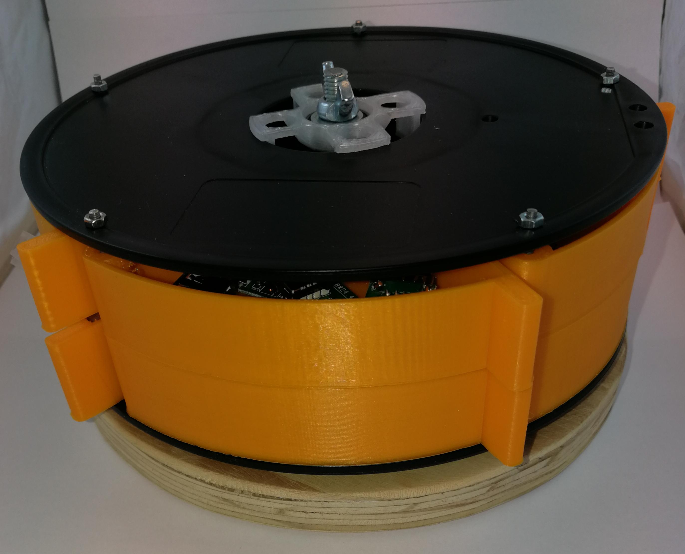
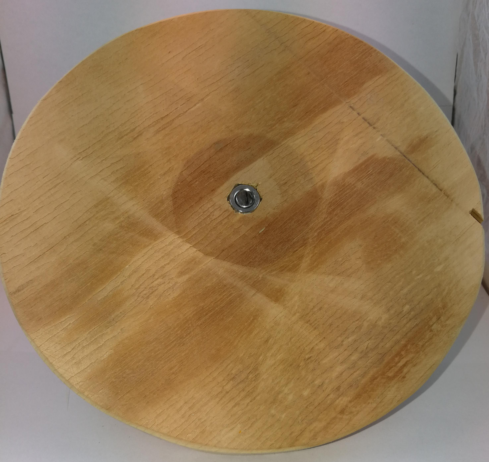
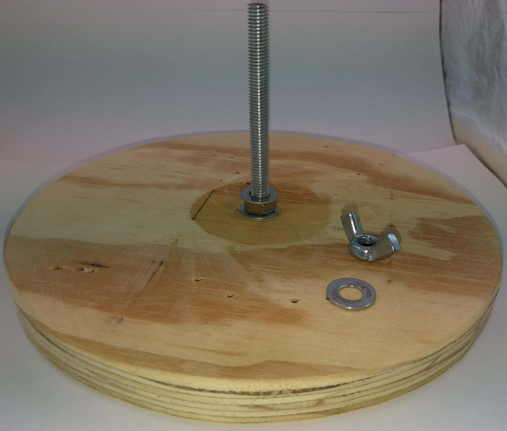
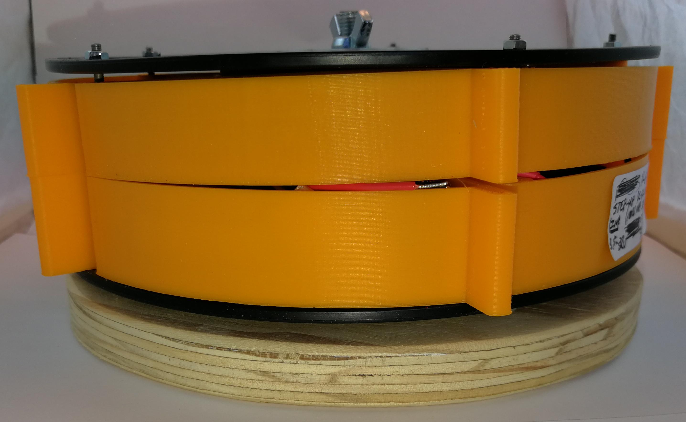
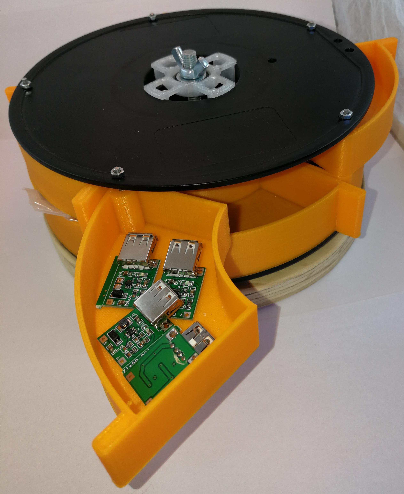
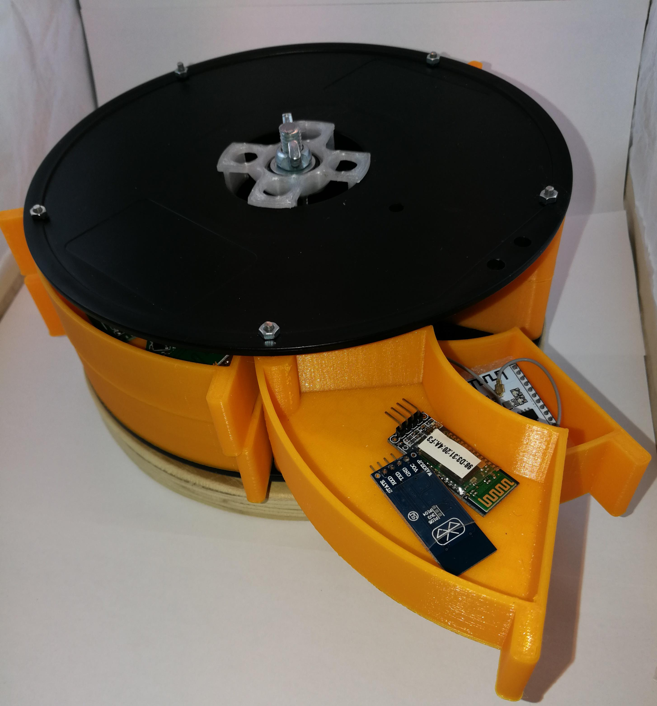

Putting empty filament spools to good use
============================================

**Table of Contents**
1. [Introduction](#introduction)
2. [Features](#features)
3. [Versions](#versions)
4. [Usage](#usage)
5. [Finishing off](#finishing-off)
6. [Pictures](#pictures)

Introduction
------------
3D printing has a tendency to generate many empty filament spools. I have always
kept the empty spools, hoping that I could someday put them to good use.

I recently did some research into what others do with their empty filament
spools and was delighted to see them being used for drawer storage units by
simply printing drawers that fit into the spools. I always have a shortage of
small drawers for electronic components, bolts, nuts, etc.

I found many different designs on Thingiverse for spool drawers, but immediately
realized that most of these designs were for specific types of empty spools.
Besides that, they mostly only give the STL files, so you are stuck with the
sizes the author chose for her system.

Not wanting to go through them all, trying to find one that will fit my empty
spools, and also wanting options to customize the drawer sizes, I settle on a
very simplistic, but clever design by **[keynes87]** made in [OpenSCAD].

Since OpenSCAD has a very useful parametric customizer interface, which is also
available on Thingiverse for customizing things, and the fact that I love
parametric design, [keynes87]'s design was the perfect candidate to build on.

[TOC]

----

Features
--------
* Supply spool dimensions to make drawer sizing and preview easy
* Allows 2 to 5 equal sized drawers per layer
* Can have 1 or 2 layers, with different drawer heights per layer.
* Allows adjusting the drawer wall and bottom thickness
* Has an assembly preview option to get an idea of the final assembly.
* Can simulate opening one drawer for visual help, or to test clearances -
  with equal sized drawers, 5 per layer is about as much as is possible
  before drawers starts interfering.
* With multi layer option selected and drawers of different height, both
  drawers will be drawn in print mode.
* Can generate a thin tester outline of the drawer to test fit the spool
  before final print.
* Can generate templates for exact drilling of the hinge holes in the
  spool. See note below.
* Color support in assembly mode.

[TOC]

----

Versions
--------
* **v1.0** - First release
* **v1.1** - Fixed bug in generating the hinge holes and add option for finger
             notch instead of handle. With the changes in the hinge hole
             generation, drawers created with the same parameters in v1.0 will
             **not** align with v1.1 and later drawers!

[TOC]

----

Usage
-----
To easily use the customizer features, you need the latest (2018+) version of
[OpenSCAD] installed on your computer. With older versions that do not support
the customizer, you can still modify the variables in the file - they are well
commented.

Open the `.scad` file in [OpenSCAD] then start customizing the design based on
your spool holder and requirements. The general order is normally:

1. Start with the `mode` set to `assembly` (under **General parameters**) - this
   allows a simulated view of the final drawer system.  
   ![Assembly mode][assymode]  

2. Enter the measured values of your spool under the **Spool dimensions**
   section. **Note** that when measuring the inner height of the spool, do it at
   the hub as far as possible. I've notice that the measurement on the brim is
   not always the same as at the inner hub which then means your drawers does
   fit very well.
   ![Spool Dimensions][spooldims]  

3. Next set your desired base drawer dimensions in the **Drawer Base** section.  
   **Note** that the `drawHeight` value should be non-zero for two layers of
   drawers. Making this value 0 will make a single layer of drawers the inner
   height of the spool minus 1mm for clearance.  
   With a non-zero value, this value will be the height for the bottom layer
   drawers.  
   ![Drawer Base][drawerbase]  

4. Set the number of drawers you want in the **Drawer Configuration** section.
   Here you can also select or unselect _dual layers_ if `drawHeight` is not
   zero.  
   With dual layers, you can also adjust the gap between the layers with the
   `layersGap` parameter.  
   Here you also select whether to have a handle (original) or newer finger
   notch option for access to open drawer. The default now is the finger notch
   since it prints quicker and saves plastic.
   ![Drawer Config][drawerconf]  

5. In `assembly` mode, you can simulate opening one of the drawers by adjusting
   the `openAngle` value under the **Drawer Configuration** section. Here it is
   also sometimes helpful to disable drawing the spool by unselecting
   `showSpool` in the **General parameters** section.  
   ![Drawer Opened][draweropen]

6. You can modify the spool and drawer colors by changing the color names based
   on the names from the OpenSCAD [color] transformation options.  
   ![Drawer Color][drawercolor]  

7. To test that your drawer config fits your spool, set the mode to `tester` in
   the **General parameters** section and print the drawer outline that is
   generated. Fit this to your spool to make sure your settings are correct.  
   ![Test Mode][testmode]  

8. Once you are ready to generate the STLs for printing, change the mode to
   `print` in the **General parameters** section. If you have dual drawer
   layers, then a model for one drawer from each layer will be generated.  
   ![Print Mode][printmode]  

9. To drill holes in the exact spots for the hinges in the spool, you can
   generate a template by setting the mode to one of the `template?` modes in
   the **General parameters** section.:
   ![Template1 Mode][template1mode]  
   ![Template2 Mode][template2mode]  
   ![Template3 Mode][template3mode]  

   Templates 2 and 3 could be 3D printed if your print area is large enough and
   you want a template that can be used on future spools of the same size.
   Template1 you probably do not want to print.

   Another option is to export the template as a DWG or SVG file, then print a
   2D copy at the exact dimension on paper as a template. My current version of
   OpenSCAD does not do the export to SVG or DWG, so this does not help.

   One way around that is to export a **top view**, as large as possible on
   screen, to and image format like PNG from OpenSCAD. I then open this PNG in
   the [Gimp], but almost any other image manipulation program should do.

   Once opened, I crop the image right at the edges to ensure that the edges of
   my spool template fills the width/height of the image, resulting in a square
   image with the spool edges at the image edges.

   Since template2 does not represent the full spool outline, this method is not
   recommended for that template.

   With the spool outline filling image, and knowing the diameter of the spool,
   it is now a simple matter of scaling the image to be equal to the exact spool
   diameter in both X and Y directions. The [Gimp] allows entering millimeter
   sizes for scaling, so this makes it very easy.  
   ![Gimp crop and scale][gimpcropscale]  

   From here the image can be manipulated (remove the black, for example) and
   printed to the correct scale on paper.

[TOC]

----

Finishing off
-------------
To complete the drawer case, I used:
  * M3 threaded rod for the drawer hinges, cut to the correct spool width and
    fastened with M3 nuts top and bottom. These should have been M4 rods, the
    spool has these ridges on the outside on exactly the point where the holes
    were supposed to go, and this made it difficult to get the holes in the
    exact spot even with the template. The result was that with M4 the
    tolerances were too tight :-(
  * Two [spool holders], from this great design by _[Sylvain Rochette]_,
    customized for this specific spool. Each spool holder contains a 608ZZ
    bearing.
  * A piece of M8 threaded rod for the central pillar.
  * A base made from scrap 18mm plywood.  
    I drilled an 8mm hole in the wood, then enlarged the hole to 12mm on the
    underside, just deep enough for the height of an M8 nut.  
    I then stuck the rod through from the top with a washer and M8 nut on the
    top, threaded another nut on the bottom and started tightening the top nut.
    This sunk the bottom into the base. I finished of getting it snug and level
    at the bottom with a few taps from a hammer.  
    This allows the threaded rod to be removed should I later need a longer rod
    if I want to add another spool on top.
  * With the rod in place, I then placed the drawer spool on the rod, marked the
    circle dimension on the base and cut it out with a jig saw.
  * Final assembly is:
    - M8 rod screwed into the sunken M8 nut at the base bottom
    - A washer and M8 nut on the top and tightened to secure the rod in place.
    - Another washer on top of the M8 nut for the spool holder bearing to rest
      on - not strictly required, but it mkes me feel better :-)
    - The drawer spool.
    - A washer on the top spool holder bearing - again, not strictly required.
    - An M8 nut, or wingnut to secure the lot.

[TOC]

----

Pictures
--------
  
 

[TOC]

----

[TOC]: /#
<!-- External links -->
[keynes87]: https://www.thingiverse.com/keynes87
[OpenSCAD]: http://www.openscad.org/
[color]: https://en.wikibooks.org/wiki/OpenSCAD_User_Manual/Transformations#color
[spool holders]: https://www.thingiverse.com/thing:596838
[Sylvain Rochette]: https://www.thingiverse.com/labidus/about
[Gimp]: https://www.gimp.org/

<!-- Image links -->
[assymode]: images/AssemblyMode.png
[spooldims]: images/SpoolDims.png
[drawerbase]: images/DrawerBase.png
[drawerconf]: images/DrawerConf.png
[drawercolor]: images/DrawerColor.png
[draweropen]: images/DrawerAngle.png "Open Drawer. Also note drawerHeight is set and dual layer is off."
[testmode]: images/TesterMode.png
[printmode]: images/PrintMode.png "This is dual layers. Single layer will generate only one drawer."
[template1mode]: images/Template1Mode.png
[template2mode]: images/Template2Mode.png
[template3mode]: images/Template3Mode.png
[gimpcropscale]: images/GimpCrop.png
